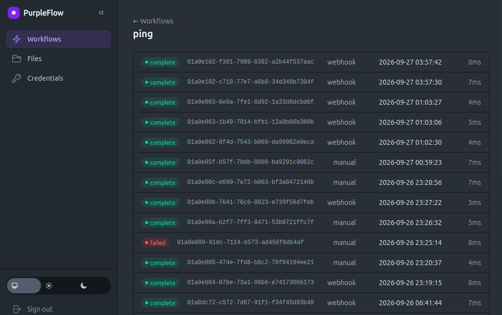

# Purple Flow

Purple Flow makes building automated workflows as easy for AI as n8n makes it for people.



## Human written intro

I love n8n with all of my heart. It's an amazing tool that's quick to learn, quick to master, and so fun and easy to build with.

But, like every solution at all ever, it has its limitations. For me, those limitations looked like:

- Stripped down AI Agent output (I want the full OpenAI JSON without an http request please)
- Limited streaming ability
- AI reasoning challenges (not much training data; most tutorials are video; MCP can be confusing for light models)
- Latency issues
- No self-hosted middle rungs between "just me" and business for (currently) $960 per month
- No Git version control without enterprise
- Scalability and licensing challenges (can't easily turn your solution into a SaaS or sell it)

### Origin story

So I built Purple Flow. It's a minimal, first-principles reimagining of n8n made with Elixir. I borrowed the architectural decisions I loved and built everything else from scratch using OTP efficiency and reliability.

All the workflows and nodes are plain-text TOML files. Easy for agents to reason about while still being human readable.

Most n8n nodes are convenience wrappers for APIs. Many of them don't cover every use case and you need to drop down to http requests anyway. AI can easily look up APIs and generate http requests for them, so no convenience wrappers are needed. Here's what you get instead:

- triggers
  - webhook
  - cron
  - manual
- nodes
  - http - your trusty http request node
  - ssh - run commands on other machines (and send them uploaded files)
  - postgres - only one db for now; but http can cover anything with a REST interface
  - code - just a reference to an actual .exs code script
  - batch - gathers items into groups for bulk work
  - wait - pauses each item for a while or until a time
  - respond - answers the webhook early while the run keeps going
  - noop - does nothing, on purpose
  - workflow - calls sub-workflows to keep things tidy and reusable
  - if/else - except not really a node; flow control is a natural part of workflows

### Getting started

Details are in the AI written section, but here's a more human friendly summary of how to get started.

1. Clone the repo.
2. Inside the repo, copy `.env.example` to `.env` and fill in the fields.
   - If you're behind Cloudflare or another proxy, set PURPLEFLOW_CLIENT_IP_HEADER. Without it, three failed sign-ins lock everyone out.
3. Make the workflows folder its own repo: `git init workflows`.
   - This lets you version control and protect your workflows.
4. Copy AGENTS.md from samples to `workflows`
   - Optionally copy the samples as well to help you and your favorite agent get your heads around the nitty gritty.
5. Run `docker compose up -d --build`
6. Visit `localhost:4000` (or your `PORT`) and sign in with your `PURPLEFLOW_ADMIN_USERNAME` and `PURPLEFLOW_ADMIN_PASSWORD`.
7. Send your friendly neighborhood agent to `yourdomain.com/agents`.
   - It will then want the `PURPLEFLOW_AGENT_TOKEN`.
   - With that token comes great power; remind your agent to be responsible.
   - (Muse has a dedicated system to keep the token out of your agent's hands and it works well with Purple Flow; just sayin') 
8. Your agent can now build workflows that connect anything to anything, just like n8n, Make, Zapier, and friends.

## Where are the connectors?

The one catch is that you don't have a bunch of convenience nodes for connectors. But with AI, you don't need them. Just have your AI look up whatever API you want to access and create your workflows.

I like using this simple pattern:
- AI calls endpoint with consistent params: {"body": {"endpoint": "list_all", "verb": "GET/POST/PUT, etc.", "parameters": {}}}
- A normalizer code node deciphers the request body and returns the expected fields as variables for the http request to slot into place.

Doing it this way avoids complex routing and building out 500 workflows/sub-workflows to match a single API.

You can create credentials (useful for any data you want kept private) in the web interface. Pass your agent the credential name for it to use in your flows.

### Security

Purple Flow is still in early alpha, but security was of the utmost concern from the beginning.

Workflows are stored and versioned locally. A Docker sidecar running [Dufs](https://github.com/sigoden/dufs) has access to the workflows folder and makes it available to agents and the web UI. That sidecar has no port and no access to the internet or the rest of the docker network, and it wants the agent token even from inside that network. It's only reachable through an API endpoint with the agent token and the Web UI.

Code nodes are pure Elixir. They also run in a dedicated sidecar with no outside access, no internet, no database, no credentials, and read only access to their own file systems. They also can't mount workflows.

Credentials are encrypted in Postgres with `PURPLEFLOW_SECRET_KEY` and unavailable to either of the sidecars.

Any secrets passed as plain text risk exposure and no level of security can help you there.

### Free as in free beer

Because you own everything, you can build full workflows for distribution to clients. And you can manage version control however you like.

Because this is built on the BEAM VM, you can scale your workflows to thousands of simultaneous executions. (And that's conservative if you're careful.) That means you can turn a convenient personal tool into a paid SaaS with just a little elbow grease.

## AI written intro

A barebones n8n on Elixir/OTP. Workflows are TOML files in git.

```
trigger (webhook / cron / manual)
  -> every step has a queue; the trigger's input goes into the first ones
  -> each step runs a node once per item: one item in, one output out
  -> a list output splits into items; each goes straight on to the next queue
  -> nothing waits for a whole step: items flow, and nodes can stream
  -> concurrency, delay, and max_queue set each step's pace
  -> a failed item stops there (or takes a "failed" route, or ends the run)
  -> the run saves its records in batches, and a Kill button stops it
```

Built-in nodes: HTTP and SSH (both can stream), Postgres, Code, Batch, Wait, Respond (answer the webhook early), Noop, and "run another workflow". A new node type is just a module implementing `execute(input, config)`.

Webhooks take file uploads. A file is saved with its run (in its own volume), steps pass around a small reference to it, an SSH step can send it on (`stdin_file`), and it's deleted when the run ends. See [specs/190](specs/190_run_files.md).

The UI (Phoenix LiveView) is one site behind one sign-in, with a side menu (a menu button on small screens):

- **Workflows**: every workflow, with a search box, its triggers, its last run, a link to its files, and a Run box. The Run box takes just the request body, and the run gets it as `input["body"]`, the same as from a webhook. Pick a workflow to see its runs (and kill a running one), and a run to see every step's queue, what's running, how many succeeded, and every execution's input and output.
- **Files**: the workflows folder, to browse and edit in place.
- **Credentials**: secrets that workflows use by name.

### Under pressure

The same stress and failure tests, run on PurpleFlow and on n8n 2.40.7:
PurpleFlow ran 10,000 one-second jobs at once in 3.2 seconds with its Code
runner under 512 MB, where n8n needed 2 GB to run 100. A run with 100
failing branches completed on PurpleFlow in half a second; n8n stopped at
the first failure, or with "continue on error" turned on, overflowed its call
stack after 208 seconds. The write-up, every number cited to a test, is in
[docs/n8n_case_study.md](docs/n8n_case_study.md); the tests themselves are
in [samples/testing/](samples/testing/).

## Running it

The supported way to run PurpleFlow is Docker Compose:

```sh
mkdir -p workflows && git init workflows   # once, before the first `up`
docker compose up -d --build   # http://localhost:4000
docker compose down
```

This starts PurpleFlow, Postgres, the Code node runner, and the files service
together, all behind one site and one sign-in: open `http://localhost:4000`
and sign in with `PURPLEFLOW_ADMIN_USERNAME` / `PURPLEFLOW_ADMIN_PASSWORD`.
Three failed sign-ins lock that address out for four hours (a restart lifts
it). Postgres has a health check, and the app container only starts once it
passes; migrations run automatically on boot, and the container restarts on
its own if the app dies. Code node scripts run in the `runner` container,
which has no secrets, no database, no internet, and no way to reach the app
(see [specs/100](specs/100_runner_container.md)). Files uploaded to webhooks
live in their own volume, `purple_flow_run_files`, only until their run ends.
See `docker-compose.yml`
and `.env.example` for the environment variables to set (`SECRET_KEY_BASE`,
`PURPLEFLOW_SECRET_KEY`, `PURPLEFLOW_ADMIN_USERNAME`,
`PURPLEFLOW_ADMIN_PASSWORD`, `PURPLEFLOW_AGENT_TOKEN`, and optionally
`PHX_HOST`, `DATABASE_URL`, `WORKFLOWS_PATH`, `PUID`/`PGID`,
`PURPLEFLOW_CLIENT_IP_HEADER` if a reverse proxy sits in front, and
`PURPLEFLOW_RUNNER_SUBNET` if the runner's default network, `10.250.250.0/24`,
collides with one of yours).

### Workflow files

Workflows live in their own folder, `workflows/` by default (`WORKFLOWS_PATH`
points it anywhere). It's yours: this repo ignores it, and it's meant to be
its own git repository. Nothing commits automatically; you manage its history.

- **The app only reads it** (mounted read-only) and picks up every change on
  its own within about two seconds. There's no reload step. If an edit breaks
  a workflow, the last version that loaded keeps running, and the Workflows
  page says so.
- **People and agents edit it through the files service** (dufs), which the
  app serves behind its own sign-in. People use the **Files** page in the UI
  (click a file to edit it; Ctrl/Cmd+S saves). Agents use `/fs/` with
  `Authorization: Bearer $PURPLEFLOW_AGENT_TOKEN`: plain HTTP (`PUT` to write
  a file, `DELETE`, `GET /fs/folder/?json` to list) and WebDAV for mounting
  it as a folder. WebDAV clients that only do Basic auth (Finder, Windows)
  can use the admin login instead. dufs has no port of its own, and it never
  sees the folder's `.git`.
- **Agents check their changes** at `GET /api/workflows` on the app, with
  the same token: what loaded, what didn't, and why.
- **Subfolders are groups.** Any folder with a `workflow.toml` is a
  workflow, at any depth, and the Workflows page lists them by folder.
  Names stay unique across all of them.
- A step's `node` and a Code node's `file` must stay inside the folder:
  relative paths only, and relative symlinks only.

Create the folder and run `git init` in it before the first `docker compose
up`. Otherwise Docker creates it, and its empty `.git`, owned by root.

See [specs/090](specs/090_workflow_files.md) and
[specs/110](specs/110_workflow_folders.md).

### Inviting an agent

Put an `AGENTS.md` at the top of the workflows folder explaining how to work
there. The app serves it, with no sign-in, at `/agents`, and replaces every
`BASE` in it with the site's address (from `PHX_HOST`). To bring in any
agent, give it that link and your `PURPLEFLOW_AGENT_TOKEN`. The token lets it
read and write workflow files and check what loaded, and nothing else: no
UI, no run history, no credentials.

### Local development

For local development without Docker, you need Elixir and Postgres (dev login
`postgres` / `postgres` on localhost):

```sh
mix setup          # install deps, create the database
mix test
mix phx.server      # http://localhost:4000
```

Outside Docker there's no runner container, so Code node scripts run inside
the app's own VM, with no isolation. The app logs a warning at boot saying so.
There's no files service either: edit `workflows/` directly, and the Files
page says so. With no admin login set, the UI is open.

- Workflows live in `workflows/` (see "Workflow files" above), and edits there load on their own in dev too. Annotated examples live in `samples/`: `hello` (webhook, per-item routes), `users` (HTTP, per-item), and `ping`; `samples/testing/` holds the pressure tests. Copy one into `workflows/` to try it. `samples/AGENTS.md` is the guide to put at the top of the workflows folder for visiting agents.
- Credentials are set at `/credentials` and used as `{{ creds.NAME }}`. See [specs/080](specs/080_credentials.md).

The design is in [specs/](specs/000_overview.md).

## License

[MIT](LICENSE) © 2026 [Lee Nathan](https://leenathan.com)